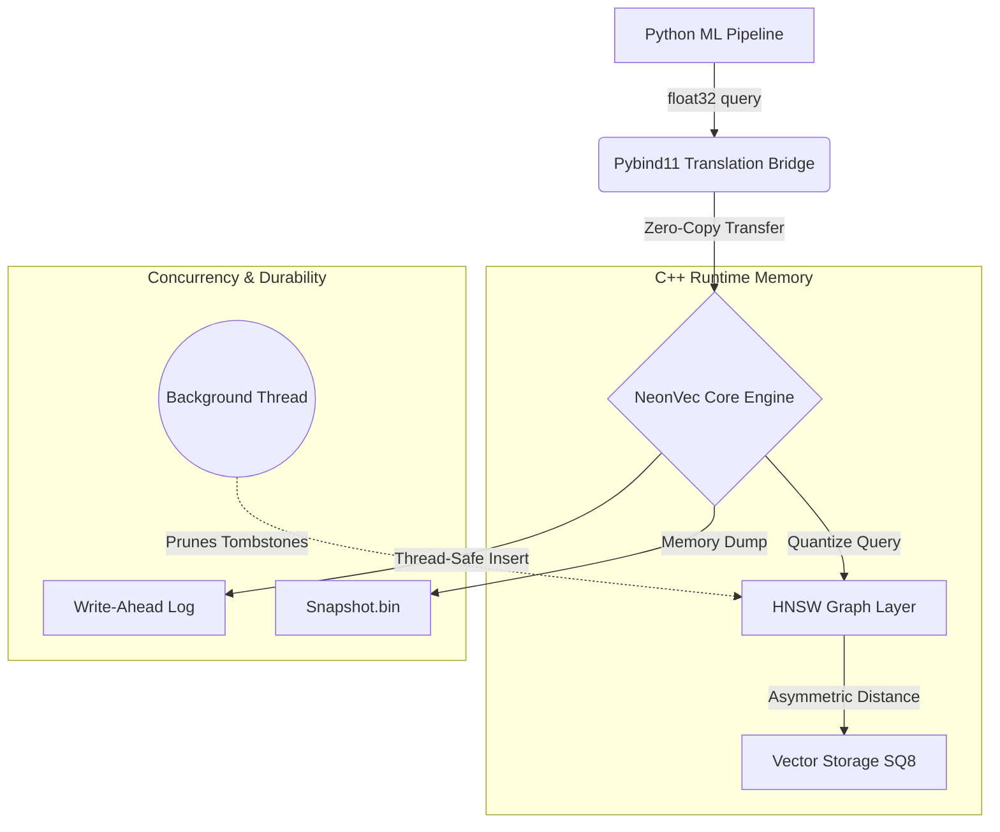

#  NeonVec

**NeonVec** is a high-performance, embedded vector database engineered in C++ from scratch. Designed specifically to handle high-dimensional machine learning embeddings (like Vision Transformer outputs), it bridges low-level hardware optimizations with a high-level, zero-copy Python API.

Running natively on Apple Silicon (M1/ARM), NeonVec leverages Asymmetric Scalar Quantization and a thread-safe Hierarchical Navigable Small World (HNSW) graph to achieve sub-millisecond nearest-neighbor search with a 75% reduced memory footprint.

## Key Architectural Features

* **HNSW Graph Indexing:** $O(\log N)$ approximate nearest neighbor search utilizing a probabilistic multi-layered skip-list.
* **8-Bit Scalar Quantization (SQ8):** Compresses 32-bit float embeddings into 8-bit integers (`int8_t`), reducing RAM usage by 75% while accelerating SIMD integer arithmetic.
* **Concurrent Execution:** Lock-free reads and thread-safe writes using `std::shared_mutex` (Reader-Writer locks).
* **Fault-Tolerant Durability:** Binary Write-Ahead Logging (WAL) with operation OpCodes ensures no data loss during sudden crashes.
* **Snapshot Compaction:** Periodic $O(1)$ raw memory dumps of the graph state to disk, enabling instant recovery and WAL truncation.
* **Ghost-Town Deletions:** Non-blocking soft deletions via thread-safe `uint8_t` tombstones, paired with an asynchronous background garbage-collection thread (using the C++ Erase-Remove idiom) to prune severed graph edges.
* **Native Python Bindings:** Compiled via `pybind11` for seamless integration into PyTorch and Hugging Face pipelines.

---

## System Architecture



---

## Mathematical Foundations

### 1. Asymmetric Scalar Quantization (ADC)
Storing standard 128-D or 768-D vectors in RAM is prohibitively expensive. NeonVec implements Scalar Quantization on ingestion, mapping floating-point ranges directly to 8-bit integers.

$$
V_{q} = \lfloor \max(-1.0, \min(1.0, V_f)) \times 127 \rfloor
$$

During a search query, the incoming 32-bit Python float vector is quantized *once*. The graph traversal then strictly computes distances using integer arithmetic, preventing the need to decompress the stored vectors.

### 2. Fast Integer L2 Distance
By relying on relative mathematical distances rather than absolute precision, NeonVec computes the squared L2 norm purely via `int32_t` multiplication, vastly reducing CPU cache misses and clock cycles.

$$
\text{Distance} = \sum_{i=1}^{d} (Q_i - V_i)^2
$$

---

## Benchmarks

Hardware: **Apple MacBook Air (M1, 2020)** | Environment: **macOS, Anaconda Python 3.11**

| Metric | Performance |
| :--- | :--- |
| **Vector Dimensionality** | 128-D (Simulated ViT Embeddings) |
| **Dataset Size** | 10,000 vectors |
| **Search Latency (k=5)** | **~1.14 ms** (0.001141 seconds) |
| **Memory per Vector** | 128 bytes *(down from 512 bytes)* |
| **Snapshot Load Time** | < 100 ms |

---

## Build Instructions

NeonVec requires CMake (3.14+) and a C++17 compatible compiler. 

```bash
# 1. Clone the repository
git clone [https://github.com/scarredhands/NeonVec]
cd NeonVec

# 2. Create build directory
mkdir build && cd build
mkdir -p ../data

# 3. Configure CMake (Point to your specific Python environment)
cmake -DPython3_EXECUTABLE=$(which python3) ..

# 4. Compile the C++ Engine and Python Bindings
make
```

---

## Quick Start (Python)

Because the compiled output is named `neonvec.cpython-...so` (or similar, depending on your system), it acts as a native Python library. Place your script in the same directory as the compiled binary.

```python
import neonvec
import random
import time

dim = 128
capacity = 10000

# 1. Initialize the engine
print("Initializing NeonVec Engine...")
db = neonvec.CoreEngine(dim, capacity, "../data/wal.bin")

# 2. Insert Vectors
print("Inserting data...")
for i in range(capacity):
    vec = [random.uniform(-1.0, 1.0) for _ in range(dim)]
    db.insert(vec)

# 3. Search
query = [0.5] * dim
results = db.search(query, k=5)

print("\n🏆 Top 5 Nearest Neighbors:")
for res in results:
    print(f"ID: {res[1]} | L2 Distance: {res[0]:.4f}")

# 4. Graveyard Deletions & Memory Compaction
db.delete(results[0][1])  # Asynchronous background thread will prune this
db.save_snapshot()        # Dumps memory to disk and truncates the WAL
```
